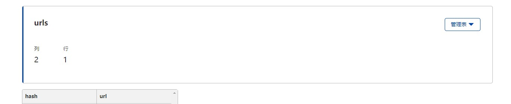

# 这是什么

这是一个基于cloudflare workers实现的短网址功能，具体用处就是提交一个比较长的url，然后他就会将其缩短，之后通过短的url便可访问长的url。

# 如何使用

1. 注册一个cloudflare账户。

2. 开通workers以及d1数据库。

   

   

3. 修改`wrangler.toml` 中的`database_id` 。

4. 部署。 

# 使用方法

| url               | body              | response                               |
| :---------------- | ----------------- | -------------------------------------- |
| POST /api/shorten | https://baidu.com | { "data": "ijShd4", "msg": "success" } |
| GET /ijShd4       |                   | 301 redirect                           |

